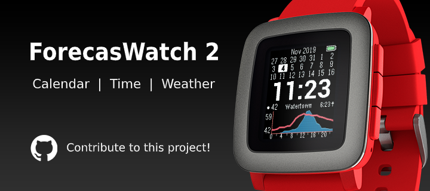

A weather watchface for Pebble inspired by ForecasWatch, with a 24-hour forecast, rain radar, and a 3-week calendar.

## Screenshots

| Pebble Time | Pebble 2 Duo | Pebble Time 2 |
| --- | --- | --- |
|  |  |  |

### Rain radar over time

The radar view as the clock advances across sunset: the 5-minute rain frames step forward, the
forecast graph slides, and night shading kicks in.

| Pebble Time 2 (emery) | Pebble Classic (aplite) |
| --- | --- |
|  |  |

### Calendar

## Features

**Time**
* Current time
* Next sunrise or sunset time

**Forecast**
* 24 hour weather forecast with configurable update frequency
* Current temperature
* Temperature forecast (red line)
* Precipitation probability forecast (blue area — half-height = 50%, full-height = 100%)
* Hourly rain precipitation bars
* Fahrenheit and Celsius temperatures
* Multiple weather providers (OpenWeatherMap, Deutscher Wetterdienst via Bright Sky, Weather Underground)
* GPS or manual location entry
* City where forecast was fetched

**Radar (for now only available for Deutscher Wetterdienst)**
* Rain radar showing live precipitation near your exact location (5-minute frames)
* Switch between calendar and radar view (flick/tap)

**Calendar**
* 3 week calendar
* Customize colors for Sundays, Saturdays, and US federal holidays

**Watch status**
* Battery indicator
* Bluetooth connection indicator
* Vibrate on disconnect
* Quiet time indicator
* Sleep mode

**Customization**
* Night shading
* Customize time font and color
* Offline configuration page

## Platforms

Pebble Classic, Pebble Steel, Pebble Time, Pebble Time Steel, Pebble 2, and Pebble Time 2 are supported.

## Installation

<!-- TODO: replace every <app-id> below (and in the badge URLs at the top) once the store listing is live -->
### Pebble Appstore

- RePebble: https://apps.repebble.com/<app-id>
- Rebble: https://apps.rebble.io/en_US/application/<app-id>

If you're using the modern Pebble app, the RePebble listing should be the simplest install path. If you prefer the Rebble flow, follow https://help.rebble.io/setup to set up your Pebble app first. The RePebble store uses Rebble's backend ([blog](https://ericmigi.com/blog/re-introducing-the-pebble-appstore)), so the they're effectively the same catalog through a different entry point.

### Manual install

If you want to sideload a specific build, use the modern Pebble app on [iOS](https://repebble.com/app) or [Android](https://repebble.com/app), which supports installing `.pbw` files directly. Download the latest [`warnweather.pbw`](https://github.com/Toasbi/WarnWeather/releases/latest/download/warnweather.pbw) release and install it with the app.

## Developers

See [CONTRIBUTING.md](CONTRIBUTING.md) for developer setup and workflow.

## Telemetry

WarnWeather includes privacy-respecting telemetry. I do not collect precise location or API keys. Account and watch identifiers are stored only as server-side HMAC hashes—enough for rough usage stats (e.g. DAU), not as readable IDs.

- Collected: each weather fetch’s outcome and duration, provider, coarse country code when available, app and watch metadata, and an allowlist of non-sensitive settings.
- Not collected: coordinates (lat/lon), city/state, manual location strings, or your API keys.
- Purpose: estimate DAU, see coarse country mix, spot weather-fetch failures, and learn which settings are common.
- You may opt-out of telemetry by disabling it in the settings.
