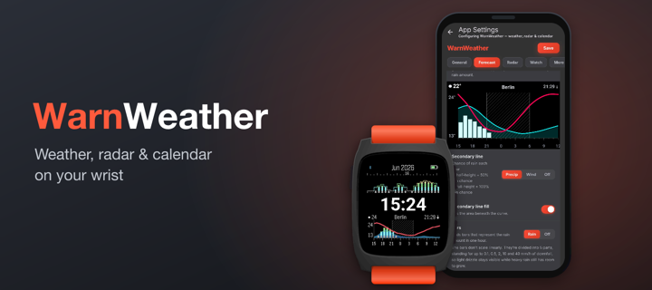
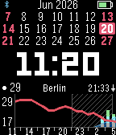
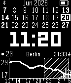
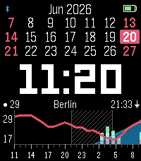

  

A weather watchface for Pebble inspired by ForecasWatch2, with a 24-hour forecast, rain radar, and a 3-week calendar.

## Screenshots

| Pebble Time | Pebble 2 Duo | Pebble Time 2 |
| --- | --- | --- |
|  |  |  |

## Features

**Time**
* Current time
* Next sunrise or sunset time

**Forecast**
* 24 hour weather forecast with configurable update frequency
* Current temperature
* Temperature forecast line
* Optional secondary line — precipitation probability (half-height = 50%, full-height = 100%, with an optional fill underneath) or wind speed with a dotted gust line above it (selectable graph scale)
* Optional hourly rain bars — multicolor or white on color watches
* Optional day/night hatch shading on the graph
* Fahrenheit and Celsius temperatures
* Multiple weather providers (Weather Underground, OpenWeatherMap, and Deutscher Wetterdienst via Bright Sky — Germany only)
* GPS or manual location entry
* City where forecast was fetched

**Radar (for now only available for Deutscher Wetterdienst)**
* Rain radar showing a 2-hour precipitation nowcast in 5-minute frames — rain at your exact location plus the strongest rain approaching from within 2 km
* Switch between calendar and radar view (flick/tap)

**Calendar**
* 3 week calendar
* Customize colors for Sundays, Saturdays, and US federal holidays

**Watch status**
* Battery indicator
* Bluetooth connection indicator
* Vibrate on disconnect
* Quiet time indicator
* Sleep mode (battery-saving night pause)

**Customization**
* Customize time font and color

## Forecast graph vs. rain radar

Two things that both involve rain over time, but answer different questions:

- **Forecast graph** — the hourly prediction, looking up to 24 hours ahead. Temperature is
  always shown; on top of it you choose what to add — the chance of rain or wind speed with
  gusts as a second line, plus optional bars for the hourly rain amount.
- **Rain radar** — unlike the forecast graph's model prediction, this is a short-term nowcast
  based on actual radar measurements moving toward you, refreshed often as new scans arrive.
  Instead of a map it's drawn as bars: the provider's radar images for the next 2 hours are
  sampled at your location, and each 5-minute frame becomes one bar whose height is the rain
  amount — solid bars are rain at your exact spot, the hatched outline behind them is the
  strongest rain within 2 km. Germany-only for now (Deutscher Wetterdienst). Good for
  *"is it about to rain on me right now?"* More providers may be added.

## Platforms

Pebble Classic, Pebble Steel, Pebble Time, Pebble Time Steel, Pebble 2, and Pebble Time 2 are supported.

## Installation

### Pebble Appstore

- RePebble: https://apps.repebble.com/67d6f1fcdb264341b850f79a
- Rebble: https://apps.rebble.io/en_US/application/6a3645239d979d000abc99db

If you're using the modern Pebble app, the RePebble listing should be the simplest install path. If you prefer the Rebble flow, follow https://help.rebble.io/setup to set up your Pebble app first. The RePebble store uses Rebble's backend ([blog](https://ericmigi.com/blog/re-introducing-the-pebble-appstore)), so the they're effectively the same catalog through a different entry point.

### Manual install

If you want to sideload a specific build, use the modern Pebble app on [iOS](https://repebble.com/app) or [Android](https://repebble.com/app), which supports installing `.pbw` files directly. Download the latest [`warnweather.pbw`](https://github.com/Toasbi/WarnWeather/releases/latest/download/warnweather.pbw) release and install it with the app.

## Developers

See [CONTRIBUTING.md](CONTRIBUTING.md) for developer setup and workflow.

## Telemetry

WarnWeather includes privacy-respecting telemetry. I do not collect precise location or API keys. Account and watch identifiers are stored only as server-side HMAC hashes—enough for rough usage stats (e.g. DAU), not as readable IDs.

- Collected: each weather fetch’s outcome and duration, provider, coarse country code when available, app and watch metadata, and an allowlist of non-sensitive settings.
- Not collected: coordinates (lat/lon), city/state, manual location strings, or your API keys.
- Purpose: estimate DAU, see coarse country mix, spot weather-fetch failures, and learn which settings are common.
- You may opt-out of telemetry by disabling it in the settings.
